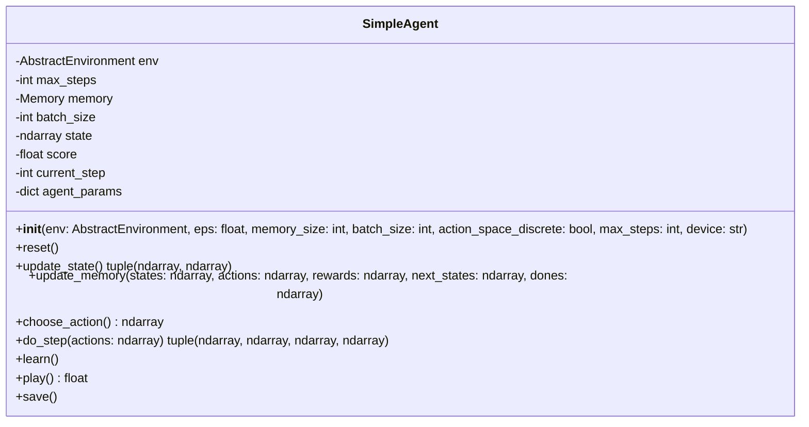

# SimpleAgent

The `SimpleAgent` class provides an agent that interacts with an environment and takes random actions without any learning. It supports discrete and continuous action spaces and can store experiences in memory.

## Class Diagram

## Attributes

| Attribute | Type | Description |
|---|---|---|
| env | `AbstractEnvironment` | The environment in which the agent operates. |
| max_steps | `int` | The maximum number of steps the agent can take per episode. |
| memory | `Memory` | Experience replay memory for storing state transitions (optional). |
| batch_size | `int` | The batch size used when sampling from memory. |
| state | `ndarray` | The current state of the agent. |
| score | `float` | The total score accumulated during an episode. |
| current_step | `int` | The current step within an episode. |
| agent_params | `dict` | Additional parameters for the agent. |

## Methods

| Method         | Arguments | Returns          | Description                                     |
|----------------|-----------|------------------|-------------------------------------------------|
| `reset` | | | Reset the environment and agent state. |
| `update_state` | | `(ndarray, ndarray)` | Update the agent's state from the environment and return the previous and new state. |
| `update_memory` | **states**: ndarray, **actions**: ndarray, **rewards**: ndarray, **next_states**: ndarray, **dones**: ndarray | | Store experience in memory. |
| `choose_action` | | `ndarray` | Choose an action randomly. |
| `do_step` | **actions**: `ndarray` | `(ndarray, ndarray, ndarray, ndarray)` | Perform a step in the environment and return state transitions and rewards. |
| `learn` | | | Dummy learning function (not implemented in this agent). |
| `play` | | `float` | Run an episode by interacting with the environment and return the accumulated score. |
| `save` | | | Save the agent’s status (not implemented). |

