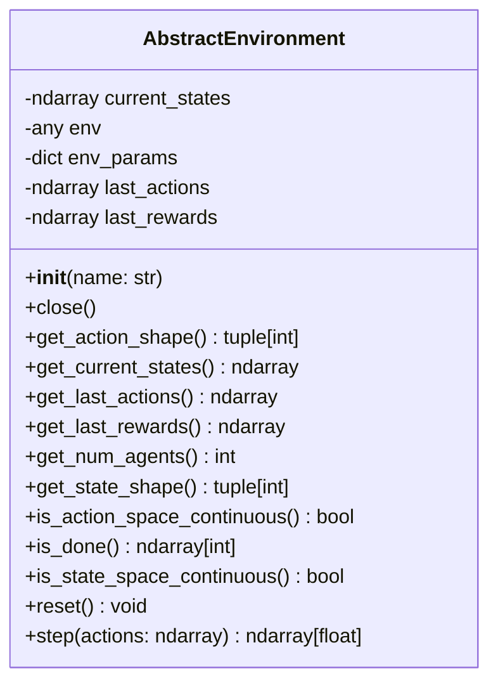

# Environments

The Environment classes are a wrapper for interacting with environment like Gymnasium or Unity ML Agent environments.

## Class Diagram

## Variables

- $\mathcal{N}_a$: Number of agents
- $\mathcal{D}_A$: action space dimension
- $\mathcal{D}_S$: state space dimension

## Attributes

| Attribute | Type | Description |
|---|---|---|
| current_states | ndarray of shape $N_a \times \mathcal{D}_S$ | The current states of the environment (last observations made by the agents) |
| env | Environment object | The environment |
| env_params | dict | Parameters that were used to initialize the environment |
| last_actions | ndarray of shape $N_a \times \mathcal{D}_A$ | Last actions taken by the agents |
| last_rewards | ndarray of shape $N_a \times 1$ | Last rewards received by the agents |

## Methods

| Method         | Arguments | Returns          | Description                                     |
|----------------|-----------|------------------|-------------------------------------------------|
| close | | | Close the environment |
| get_action_shape | | Shape of action  | Get the shape $N_a \times \mathcal{D}_A$ of actions that this environment accepts.
| get_current_state | | State represented by a $\mathcal{N}_a \times \mathcal{D}_S$ vector. | Get the current state of the environment.
| get_last_actions | | Last actions taken by the agents represented by a $\mathcal{N}_a \times \mathcal{D}_A$ vector. | Get the last actions taken by the agents.
| get_last_rewards | | Last rewards represented by a $\mathcal{N}_a \times 1$ vector. | Get the last rewards of the agents received by the last actions taken.
| get_num_actions | | Number of available actions | Get the number of available actions in this environment. If the environment is continuous this method will return infinity.           |
| get_num_agents | | Number of agents | Get the number of agents $\mathcal{N}_a$ in this environment           |
| get_state_shape  | | Shape of state   | Get the shape $N_a \times \mathcal{D}_S$ of the state of this environment         |
| is_action_space_continuous | | True if the action space is continuous, False if the action space is discrete. | Is action space continuous? |
| is_done | | Binary integer array containing zeros and ones of shape $\mathcal{N}_a \times 1$ indicating for each agent if can still act or if it reached its goal | Check if agents can still act of if they reached their goal | 
| is_state_space_continuous | | True if the state space is continuous, False if the state space is discrete. | Is state space continuous?
| render | | RGB array of rendered environment | Render the environment
| reset | | | Reset the environment
| step | **actions**: Action vector of shape $\mathcal{N}_a \times \mathcal{D}_A$ | Rewards for each agent represented by a float array of shape $\mathcal{N}_a \times 1$| Each agent executes an action and receives a reward.
