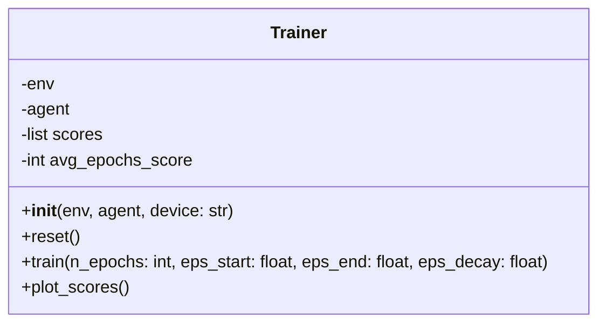

# Trainer

The `Trainer` class is responsible for training an agent in a given environment. It manages training episodes and stores performance metrics.

## Class Diagram

## Attributes

| Attribute | Type | Description |
|---|---|---|
| env | `object` | The environment in which the agent is trained. |
| agent | `object` | The agent being trained. |
| scores | `list` | A list containing the scores from each episode. |
| avg_epochs_score | `int` | The number of epochs used for calculating the moving average of scores. |

## Methods

| Method         | Arguments | Returns          | Description                                     |
|----------------|-----------|------------------|-------------------------------------------------|
| `reset` | | | Reset training progress by clearing scores. |
| `train` | **n_epochs**: `int`, **eps_start**: `float`, **eps_end**: `float`, **eps_decay**: `float` | | Train the agent for a specified number of epochs using an epsilon-greedy strategy. |
| `plot_scores` | | | Plot the training scores over time. |

