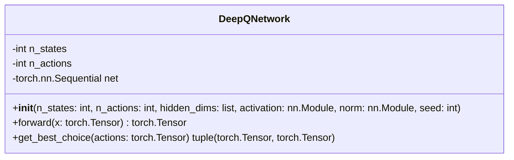

# DeepQNetwork

The `DeepQNetwork` class implements a simple feed-forward neural network to map state information to actions. It is used in reinforcement learning to approximate Q-values.

## Class Diagram

## Attributes

| Attribute | Type | Description |
|---|---|---|
| n_states | `int` | The number of state features. |
| n_actions | `int` | The number of possible actions. |
| net | `torch.nn.Sequential` | The neural network model mapping states to actions. |

## Methods

| Method         | Arguments | Returns          | Description                                     |
|----------------|-----------|------------------|-------------------------------------------------|
| `forward` | **x**: `torch.Tensor` | `torch.Tensor` | Pass the state vector through the network and obtain action scores. |
| `get_best_choice` | **actions**: `torch.Tensor` | `(torch.Tensor, torch.Tensor)` | Retrieve the best action index and corresponding value. |
